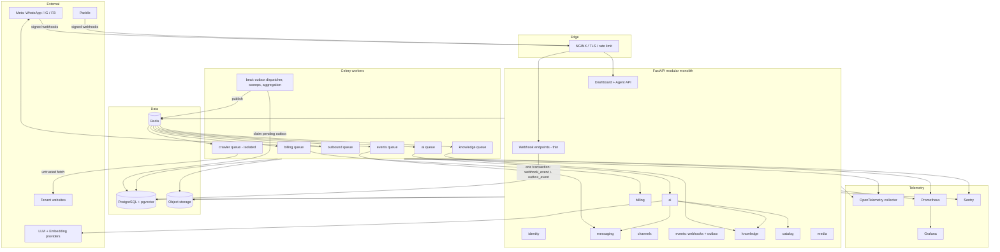

# Architecture

> Describes the **target** architecture. Phases 0–3 are implemented: the FastAPI application foundation, the PostgreSQL/Redis/Celery infrastructure foundation, and the identity module. Everything else is still design.
> Companion documents: `database.md`, `security.md`, `ai.md`, `messaging.md`, `billing.md`, `deployment.md`, `observability.md`, `integrations.md`, `operations.md`.

---

## 1. Executive summary

A **modular monolith** in Python/FastAPI, backed by one PostgreSQL database (shared schema, `tenant_id` isolation), Redis, and Celery workers, deployed with Docker behind NGINX.

Inbound messages and comments from WhatsApp, Instagram and Facebook arrive at thin webhook endpoints that verify the signature, validate the payload, resolve the tenant, and — **in a single PostgreSQL transaction** — write a durable `webhook_events` row and an `outbox_events` row. A dispatcher publishes outbox rows to Celery; idempotent consumers normalise the event into the internal conversation model and drive AI or human responses. The system never treats `commit → enqueue` as atomic.

AI is isolated behind internal abstractions. The LLM has no database access and can only act through validated, tenant-scoped, audited tools. Retrieval uses PostgreSQL + pgvector. All external providers (Meta, Paddle, LLM vendors, object storage) sit behind internal interfaces.

OpenTelemetry provides tracing and correlation from HTTP request through outbox, Celery, AI run and provider call. Prometheus/Grafana provide metrics; Sentry provides error tracking.

No Kubernetes, Kafka, Elasticsearch, service mesh or microservices — each is deferred behind a documented trigger.

---

## 2. Architectural principles

1. **Modular monolith first.** One deployable, strict internal boundaries, extraction only on a measurable trigger.
2. **Tenant isolation everywhere.** Not just in SQL — also Redis keys, object keys, vector filters, task payloads, caches, exports and AI tools.
3. **Trusted context only.** Tenant identity is derived server-side from the session/membership or from the resolved channel integration.
4. **Durability lives in PostgreSQL.** Redis is a cache, a broker and a coordination primitive — never a source of truth.
5. **Atomic intent.** State changes and the work they imply are committed together (transactional outbox).
6. **Idempotent by default.** Every external event and every task can safely run twice.
7. **Provider-replaceable.** Vendor APIs live in adapters behind internal interfaces.
8. **The model is untrusted.** LLM output is validated; retrieved and crawled content is data, never instructions.
9. **Observable by construction.** Correlation identifiers cross every process and time boundary.
10. **Simplicity is a feature.** Every added component must justify its operational cost.

---

## 3. High-level architecture



---

## 4. Detailed component architecture

### 4.1 Edge (NGINX)
TLS termination, HTTP/2, security headers, request size limits, coarse IP rate limiting, static asset serving, upstream health checks. Webhook paths get their own limits and body-size caps.

### 4.2 API process (FastAPI)
Authentication, tenant-context resolution, RBAC, Pydantic validation, thin webhook ingestion, dashboard and agent APIs, health/readiness/liveness. **No heavy work**: no AI calls, no crawling, no embedding, no large provider fan-out.

As of Phase 3 the first three of those are real: a request is authenticated from an opaque session cookie or a bearer API key, the tenant context is resolved server-side from an active membership, and RBAC is checked before the service acts. Argon2id hashing is the one deliberately expensive operation in the API process; it is bounded by configuration and never held inside a database transaction.

### 4.3 Worker processes (Celery)
Same codebase, different entrypoint, queue-scoped. Consume outbox-published tasks; own AI generation, retrieval indexing, document processing, outbound delivery, billing event processing, usage aggregation, sweeps and (later) crawling.

### 4.4 Beat / scheduler
Outbox dispatcher, stuck-event reclaim, dead-letter alerting, usage aggregation, billing reconciliation, token/session cleanup, backup verification hooks.

None of these are implemented. Two are now owed to the identity module: expired-session cleanup and audit-log retention. `sessions_absolute_expires_at_idx` exists so the first can be cheap when it is written.

### 4.5 Data plane
PostgreSQL is the system of record, including vectors. Redis carries the broker, caches, rate limits and short locks. Object storage carries all binaries with tenant-scoped keys.

Phase 3 is the first consumer of that split: sessions, memberships and roles are authoritative in PostgreSQL, while Redis holds only a short-TTL role-slug cache that can be dropped at any moment without affecting correctness.

---

## 5. Module boundaries — conceptual vs physical

**Conceptual domain** = how we reason about ownership. **Physical package** = what exists on disk. They are deliberately not one-to-one (ADR-0011).

| # | Conceptual domain | Physical package | Sub-packages | Owns (tables) | Status |
|---|---|---|---|---|---|
| 1 | Identity & Access | `identity` | `services`, `api` | tenants, users, memberships, roles, permissions, role_permissions, membership_roles, sessions, api_keys, email_tokens, audit_logs | **Implemented (Phase 3)** |
| 2 | Conversations | `messaging` | `contacts`, `conversations`, `messages`, `handoff` | contacts, conversations, messages, message_attachments, assignments, handoff_requests, conversation_summaries | Planned |
| 3 | Channel Integration | `channels` | `registry`, `providers/whatsapp`, `providers/instagram`, `providers/messenger`, `providers/comments` | channel_integrations, channel_accounts, provider_message_map | Planned |
| 4 | Event & Delivery Backbone | `events` | `webhooks`, `outbox`, `dispatcher`, `idempotency`, `deadletter` | webhook_events, outbox_events, processed_events, delivery_attempts | **Next (Phase 4)** |
| 5 | AI Assistant | `ai` | `orchestration`, `context`, `tools`, `guardrails`, `providers`, `runs` | ai_agents, ai_runs, ai_tool_calls, ai_guardrail_events | Planned |
| 6 | Knowledge (RAG) | `knowledge` | `sources`, `documents`, `pipeline`, `embeddings`, `retrieval` | knowledge_sources, documents, document_versions, document_chunks, chunk_embeddings, processing_jobs | Planned |
| 7 | Commerce Catalog | `catalog` | `products`, `inventory`, `pricing`, `search` | products, product_variants, prices, inventory_items, categories, product_attributes, product_images | Planned |
| 8 | Commercial | `billing` | `plans`, `subscriptions`, `entitlements`, `usage`, `providers/paddle` | plans, features, plan_features, billing_customers, subscriptions, billing_events, invoices, usage_events, usage_aggregates, entitlement_overrides | Planned |
| 9 | Media | `media` | `storage`, `objects`, `signing` | media_objects | Planned |
| 10 | Web Ingestion | `crawler` | `validation`, `fetch`, `extract`, `jobs` | crawl_jobs, crawl_pages | Planned |

Row 1's owned-table list has been reconciled with what migration `0002_identity_access` actually creates. Two differences from the original sketch:

- **There is no `credentials` table.** `password_hash` is a column on `users`. A credential with no independent lifecycle, no second row per user and no separate access pattern does not earn a table; if per-credential-type rows are ever needed (passkeys, for instance), that is an additive expand migration, not a redesign.
- **Three join and record tables were missing** from the sketch and are listed now: `role_permissions`, `membership_roles` and `audit_logs`.

The planned sub-packages (`users`, `auth`, `sessions`, `apikeys`, `tenancy`, `rbac`) were not created as directories — see §7.

**Cross-cutting (not domains):**

| Package | Contents |
|---|---|
| `core` | settings, database session/engine, Celery app, logging, OpenTelemetry bootstrap, error handling, security primitives (hashing, tokens, signatures) |
| `platform` | shared kernel: `TenantContext`, `ActorContext`, pagination, ID generation, money types, audit log writer, rate limiter, clock |

Phase 3 filled in parts of both: `core/security.py` holds the hashing, token-generation, digest and API-key primitives; `platform/ids.py` and `platform/clock.py` hold ID generation and the clock. Two items sit differently than planned — `TenantContext` and the audit writer live in `identity` rather than `platform`, because both depend on identity's own domain types and hoisting them would invert the dependency. The rate limiter does not exist yet.

**Deliberate consolidations (from the first draft):**

- `auth` + `users` + `tenancy` + `rbac` → **`identity`** — one lifecycle, one set of invariants; splitting them produced circular dependencies.
- `knowledge` + `rag` → **`knowledge`** — RAG is a capability of the knowledge domain, not a peer of it.
- `webhooks` + `events` + outbox + idempotency → **`events`** — one delivery backbone with one reliability model.
- `entitlements` + `usage` → sub-packages of **`billing`** — entitlements are meaningless without plans and usage.
- `handoff` → sub-package of **`messaging`** — promote to a module if routing/SLA/skills logic grows.
- `audit`, `notifications`, `observability` → `platform` / `core` — cross-cutting utilities, not domains.

The first of those consolidations was vindicated in Phase 3: sessions reference users, memberships bridge users and tenants, roles attach to memberships, and API keys are minted against a membership's permissions. Any cut between those four would have needed an import back across it.

**Why `crawler` is separate from `knowledge`:** conceptually it feeds Knowledge, but it is an untrusted, network-restricted workload with its own deployment and security boundary (ADR-0012). This is the clearest example of conceptual and physical boundaries deliberately diverging.

---

## 6. Module dependency rules

```
HTTP / task entrypoint
   ↓
application service   (orchestration, transactions, authorisation)
   ↓
domain               (entities, invariants, policies — no I/O)
   ↓
repository           (tenant-scoped data access)
   ↓
PostgreSQL
```

1. A module exposes a **public service interface**; everything else is internal.
2. No module imports another module's repositories, ORM models, or private services.
3. Each table has exactly one owning module. Cross-module reads go through the owner's interface.
4. Provider adapters depend on internal interfaces; the domain never imports a vendor SDK.
5. `core` and `platform` may be imported by anyone; they import no domain module.
6. AI tools call application services — never repositories.
7. Asynchronous cross-module communication uses `events` (outbox), not direct task imports.

**Allowed dependency graph (→ = may call):**

```
identity   ← (everyone, for tenant/actor/permission checks)
platform, core ← (everyone)

channels   → identity, events, media
events     → identity
messaging  → identity, channels, media, events
ai         → identity, messaging, knowledge, catalog, billing(entitlements+usage), events
knowledge  → identity, media, events
catalog    → identity, media
billing    → identity, events
media      → identity
crawler    → knowledge (narrow ingestion interface only)
```

Cycles are prohibited. If module A needs to react to something in module B, B emits an outbox event and A consumes it.

`identity` sits at the root of that graph and, correctly, imports no other domain module — only `core` and `platform`. Every later module depends on it, so it must never depend on any of them. The layering inside it follows the stack above exactly: `domain.py` has no I/O and imports nothing from SQLAlchemy, services orchestrate and authorise, repositories are the only code that issues queries. That is what makes the whole module unit-testable without a database.

---

## 7. Repository structure (target)

```text
omnichannel/
├─ PROJECT_CONTEXT.md  CURRENT_STATE.md  ENGINEERING.md  DECISIONS.md  TODO.md
├─ docs/
│   └─ architecture.md database.md security.md ai.md messaging.md
│      billing.md deployment.md observability.md integrations.md operations.md
├─ backend/
│  ├─ pyproject.toml
│  ├─ alembic.ini
│  ├─ alembic/versions/
│  ├─ app/
│  │  ├─ main.py                 # API entrypoint
│  │  ├─ worker.py               # Celery entrypoint
│  │  ├─ core/                   # settings, db, celery, logging, otel, errors, crypto
│  │  ├─ platform/               # tenant/actor context, pagination, ids, audit, ratelimit
│  │  └─ modules/
│  │     ├─ identity/  messaging/  channels/  events/  ai/
│  │     └─ knowledge/ catalog/   billing/   media/    crawler/
│  └─ tests/ {unit,integration,security,contract,fixtures}
├─ infra/ {docker,nginx,prometheus,grafana,scripts}
└─ .github/workflows/
```

Each module follows the same internal shape (only the parts it needs):

```text
modules/<module>/
├─ api/            # routers + request/response schemas
├─ services/       # application services (public interface)
├─ domain/         # entities, value objects, policies
├─ models/         # SQLAlchemy models (private to the module)
├─ repositories/   # tenant-scoped data access (private)
├─ tasks/          # Celery tasks (thin wrappers over services)
├─ events/         # published/consumed event contracts
├─ providers/      # external adapters, if any
└─ tests/
```

**How `identity` actually landed, and why.** It ships `api/` and `services/` as packages, but `domain`, `models` and `repositories` as single modules rather than directories:

```text
modules/identity/
├─ api/            routes.py, schemas.py, dependencies.py
├─ services/       authentication, sessions, api_keys, permissions,
│                  provisioning, audit, authorization, validation
├─ domain.py       enums, grants, Principal, TenantContext, normalisation
├─ errors.py       domain errors over the ADR-0013 envelope
├─ models.py       the eleven tables
└─ repositories.py TenantScopedRepository and the global-scope repositories
```

Each of those three is one cohesive unit — the tables share a base class and foreign-key each other, the repositories share a scoping base, and the domain rules are a few hundred lines of enums and pure functions. Splitting them into packages would have produced directories containing a single file plus an `__init__.py` re-exporting it. The prescribed shape above stays the target for modules that grow past that point, and `services/` is already a package precisely because it did.

What the rule is really protecting is rule 2 of §6: `models` and `repositories` are private to the module regardless of whether they are files or directories. Nothing outside `identity` imports either. `tasks/`, `events/` and `providers/` are absent because identity has no Celery task, publishes no event yet, and talks to no external provider. Tests live in the shared `tests/unit` and `tests/integration` trees rather than per-module, matching the Phase 1 layout.

---

## 8. Current → Future → Trigger

| Component | CURRENT | FUTURE | TRIGGER |
|---|---|---|---|
| Deployment | Single server, Docker Compose | Split API / worker / crawler hosts | CPU sustained > 70 %, or zero-downtime deploys required |
| API | 1 container, N Uvicorn workers | Replicas behind NGINX | p95 latency SLO breach or CPU saturation |
| Workers | Shared worker, queue routing | Dedicated AI / crawler / events workers | Queue backlog > 5 min or one queue starving another |
| PostgreSQL | Self-hosted container | Managed, then replicas, then partitioning | Ops burden, PITR needs, I/O or connection pressure |
| Redis | Self-hosted container | Managed / HA | Multi-host deployment or reliability requirement |
| Vectors | pgvector on primary | Replica → separate PG → dedicated vector DB | Retrieval p95 SLO breach or OLTP degradation |
| Search | SQL filters + full-text | Hybrid (BM25 + vector) rerank | Measured retrieval quality gap |
| Tenant isolation | Application-scoped repositories — **implemented in Phase 3** as `TenantScopedRepository`, so scoping is structural rather than a filter each call site must remember | + PostgreSQL RLS | Schema stable, or compliance requirement |
| Session storage | PostgreSQL authoritative, **no cache** — one indexed lookup on `sessions.token_digest` per authenticated request, plus an epoch check against the user row — **implemented in Phase 3** | Unchanged. A read-through cache is deliberately **not** planned: it would reintroduce a staleness window on the revocation path (`security.md` §2.10) | Auth lookup shows up in latency profiling |
| Role/permission resolution | Role slugs read from PostgreSQL and cached in Redis for ≤ 60 s, then expanded into permissions through the in-process `DEFAULT_ROLE_GRANTS` table — `role_permissions` is seeded and parity-tested but not read at runtime — **implemented in Phase 3** | `role_permissions` becomes the runtime source, making the grant matrix editable data rather than code | Tenant-defined custom roles (P2) |
| Outbox dispatch | Poller with `SKIP LOCKED` | + `LISTEN/NOTIFY` hint | Dispatch latency budget < 1 s |
| Tracing | OTel → collector → Sentry | Tempo/Jaeger or managed APM | Trace volume/retention needs |
| Crawler | Designed only | Isolated egress-restricted workers | Tenants require website ingestion |
| Visual search | Schema headroom only | Image embeddings + similarity | Proven customer demand |
| Rate limiting | Per-account login lockout only | Shared limiter across auth, webhooks, AI and uploads | Before any public exposure |

---

## 9. Data flows (index)

| Flow | Document |
|---|---|
| Incoming WhatsApp message | `messaging.md` §6 |
| Instagram / Facebook comment | `messaging.md` §7 |
| Outbound delivery + retries | `messaging.md` §8 |
| Human handoff | `messaging.md` §9 |
| AI response generation | `ai.md` §4 |
| Document ingestion → RAG | `ai.md` §6 |
| Website crawling | `ai.md` §8 |
| Billing webhook | `billing.md` §5 |
| Authentication and tenant resolution | `security.md` §2 |
| Authorisation and RBAC | `security.md` §3 |

---

## 10. Scalability strategy

Ordered steps, each gated by a measurable trigger. Do not pre-build them.

| Step | Action | Trigger |
|---|---|---|
| 1 | Vertical scale the single server | Any sustained resource pressure |
| 2 | API replicas behind NGINX | API CPU > 70 % sustained, or p95 SLO breach |
| 3 | Worker replicas + queue separation | Backlog age > 5 min on any queue |
| 4 | Dedicated AI workers | AI tasks occupy > 60 % of worker time |
| 5 | Dedicated crawler hosts | Crawl volume or stricter isolation needs |
| 6 | Managed PostgreSQL | Backup/PITR/HA operational burden |
| 7 | PgBouncer | Connection count approaches `max_connections` |
| 8 | Read replicas | Read-heavy analytics/reporting pressure |
| 9 | Partitioning (messages, events, usage) | Table > ~100 M rows or slow retention deletes |
| 10 | Extract a service | Independent scaling/reliability/ownership need |

One Phase 3 note for step 2: sessions are server-side but stored in PostgreSQL — shared by every replica, and held in no process-local state — so API replicas need no sticky sessions. Argon2id is CPU-bound by design and will show up in step 2's CPU trigger sooner than most endpoints — login cost is a deliberate purchase of resistance to offline cracking, and the correct response to that pressure is more API capacity, not cheaper hashing.

---

## 11. Performance considerations

- Composite indexes lead with `tenant_id`; keyset pagination everywhere unbounded.
- Webhook endpoint budget: p95 < 150 ms (verify + validate + one transaction + return).
- Outbox dispatch budget: p95 < 1 s from commit to task publication.
- AI context is bounded: recent turns + a rolling summary + top-K chunks — never the full history.
- Batch embedding generation; cache embeddings by content hash.
- Cache only non-authoritative, tenant-scoped data with short TTLs and explicit invalidation.
- Never call an external provider inside a database transaction.
- Bound every external call with a timeout, retry policy and circuit-breaking behaviour.
- Track slow queries (`pg_stat_statements`) from the first production day.
- Authentication is one indexed lookup: sessions by unique `token_digest`, API keys by unique `key_id`. Never scan and hash.
- Password hashing is deliberately slow and belongs outside any transaction — never hash while holding a row lock.

---

## 12. Open questions

1. Which channel launches first?
2. Do AI replies auto-send at launch, or require agent approval (per channel)?
3. First LLM/embedding provider and model?
4. Initial plan/price/limit matrix?
5. Production host and object storage provider?
6. Frontend framework and hosting (affects CORS/cookie setup)?
7. Catalog: native-first, imported from a commerce platform, or both?
8. Which commerce/order system must integrate first, if any?
9. Data residency, retention and compliance obligations?
10. Launch languages for AI responses?
11. Multiple brands/pages per tenant at launch?
12. Multiple AI agents/personas per tenant at launch?
13. Expected message volume per tenant (capacity model input)?
14. Are public comment replies held for approval by default?
15. What must be visible in the audit log for launch? — *partially answered.* The identity half is settled and implemented: authentication outcomes, membership and role changes, and API-key lifecycle (`security.md` §10.1). The conversation, AI and billing half is still open.

Question 6 acquired a dependency in Phase 3: the session and CSRF cookies use the `__Host-` prefix, which forbids a `Domain` attribute. The dashboard must therefore be served from the same origin as the API, or the cookie strategy has to be revisited before a split-origin frontend can work. This is a constraint to design around, not a defect — it is exactly the subdomain-injection protection the prefix exists to provide.

---

## 13. Risks

| # | Risk | Impact | Mitigation |
|---|---|---|---|
| 1 | Cross-tenant data leak | Critical | Scoped repositories, mandatory isolation tests, audit logs, RLS later |
| 2 | Prompt injection via documents/pages/messages | High | Untrusted-content framing, tool authorisation, output validation, handoff |
| 3 | Duplicate/out-of-order provider events | High | Dedup keys, outbox, `processed_events`, per-conversation ordering |
| 4 | AI fabricates price/stock/policy | High | Tools + retrieval are the only authoritative sources; refuse-and-escalate |
| 5 | Crawler SSRF | Critical | IP/DNS/redirect validation, IP pinning, egress restriction, isolated workers |
| 6 | Billing state drift | High | Webhooks authoritative + idempotent + reconciliation sweep |
| 7 | Unbounded AI cost | High | Per-tenant usage metering, entitlement caps, cost alerts |
| 8 | Meta API change | Medium | Adapters + contract tests on recorded payloads |
| 9 | Outbox backlog unnoticed | High | Pending-depth and oldest-age alerts, dead-letter alerting |
| 10 | Single-server failure | High | Tested restore, documented rebuild runbook, RTO < 4 h |
| 11 | Module boundary erosion | Medium | Import rules in CI, review discipline, ADRs |
| 12 | Malicious upload | Medium | Type/size validation, isolated storage, scanning, no execution path |
| 13 | Credential stuffing against the login endpoint | High | Argon2id, per-account lockout; **per-address rate limiting is not yet implemented** and is required before public exposure |

Risk 1's mitigation is now partly built rather than planned: `TenantScopedRepository` makes an unscoped query on a tenant-owned table difficult to express by accident, and the identity integration suite asserts the negative cases directly. That covers the SQL surface for one module; Redis, object storage, retrieval and AI tools remain to be covered as those modules land.

---

## 14. Postponed decisions

Kubernetes · Kafka/event streaming · Elasticsearch/OpenSearch · dedicated vector database · microservice extraction · database/schema per tenant · RLS timing · managed PostgreSQL/Redis vendor · external IdP · MFA mechanics · enterprise SSO/SCIM · visual-search model · data warehouse/BI · workflow engine (Temporal) · multi-region · data residency · ABAC/custom roles · CDN strategy.

Still postponed after Phase 3. ADR-0009 and ADR-0015 were written so that adding an external IdP, MFA or SSO later changes only how a session is **established**, never how it is **validated** — which is what keeps these three cheap to defer. Custom roles are likewise deferred but not designed out: `roles.tenant_id` is nullable precisely so a tenant-owned role can be added without a schema change.

---

## 15. Implementation roadmap

See `CURRENT_STATE.md` for live status. Reordering rationale is recorded below the table.

| Phase | Name | Key outcome |
|---|---|---|
| 0 ✅ | Architecture & documentation | This document set; ADR-0001–0012 |
| 1 ✅ | Repository & application foundation | FastAPI shell, config, logging, OTel bootstrap, lint/type/test gates, health endpoints |
| 2 ✅ | Config, Docker, PostgreSQL, Alembic, Redis, Celery | Local environment, migration workflow, worker + beat skeletons |
| 3 ✅ | Identity | Users, auth sessions, tenants, memberships, RBAC, API keys, audit log; migration `0002_identity_access`; ADR-0015 |
| 4 ◀ | **Event backbone** | `webhook_events`, `outbox_events`, dispatcher, `processed_events`, dead-letter, replay tooling |
| 5 | Conversations | Contacts, conversations, messages, attachments, normalized model |
| 6 | Channels & webhook ingestion | Provider abstraction, Meta adapters, signature verification, ingestion on the outbox |
| 7 | Outbound delivery | Delivery attempts, idempotency keys, retries, rate-limit handling |
| 8 | AI foundation | Provider abstraction, orchestrator, context builder, tool registry, guardrails, AI runs, usage/cost |
| 9 | Knowledge & RAG | Uploads, parsing, chunking, embeddings, pgvector retrieval, isolation tests |
| 10 | Catalog | Products, variants, prices, inventory, images, product tools |
| 11 | Human handoff | Handoff requests, assignment, agent workspace, AI summary, hand-back |
| 12 | Billing, entitlements, usage | Plans, Paddle adapter, webhooks, entitlement checks, metering, reconciliation |
| 13 | Observability hardening | Dashboards, alert rules, trace export, runbooks |
| 14 | CI/CD & production deployment | Pipelines, images, NGINX/TLS, migrations, backups, rollback |
| 15 | Website crawler | ADR-0012 controls, isolated workers, crawl → knowledge pipeline |
| 16 | Visual product search | Image embeddings, tenant-scoped similarity |
| 17 | Load & security testing, hardening | Load tests, isolation/pen tests, restore rehearsal, readiness checklist |

**Phase 4 has not been started.** It is the next phase and requires explicit approval before work begins.

**Why this differs from the original ordering**

1. **The event backbone moved before channels (new Phase 4).** The outbox is now foundational (ADR-0003); channels, billing, AI and knowledge all publish through it. Building it after webhook ingestion would mean retrofitting reliability into live code paths.
2. **Outbound delivery is its own phase (7).** Sending to a provider is the main non-idempotent external side effect and deserves explicit attempt records and retry semantics rather than being buried inside channels.
3. **Observability is split.** A baseline (structured logs, OTel bootstrap, health endpoints) lands in Phase 1 because retrofitting context propagation is expensive; dashboards and alerts harden in Phase 13.
4. **Usage metering folded into Phase 12** rather than standing alone — it shares tables and lifecycle with billing and entitlements.
5. **Crawler and visual search moved after launch readiness** — neither is launch-critical, and the crawler carries the highest security cost in the system.

**Phase 3 in retrospect.** Identity landed before the event backbone, which was the right order: `audit_logs` needs an actor, and every module after this one needs a `TenantContext` to scope against. It also means the outbox arrives into a codebase where tenant scoping and authorisation already exist, so event payloads can carry a tenant id that something is prepared to verify. The one thing Phase 3 deferred that Phase 4 will want is a rate limiter — webhook endpoints need one, and it should be built as shared infrastructure rather than an events-module detail.
