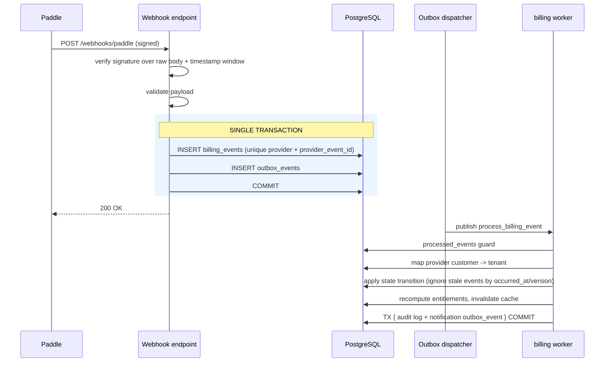

# Billing, Plans, Entitlements and Usage

> Provider-agnostic billing with Paddle as the initial adapter (ADR-0007). Design phase.

---

## 1. Principles

1. **Provider-agnostic core.** Plans, entitlements, subscriptions and usage live in our database.
2. **Provider webhooks are the source of truth** for subscription state.
3. **Frontend/checkout state is never authoritative.**
4. **Entitlement checks are local** — fast, and available during a provider outage.
5. **Every billing event is idempotent and auditable.**
6. **Limits fail predictably**, with a documented behaviour per limit.

---

## 2. Model

```
plans ──< plan_features >── features        (global catalogue)
tenants ── billing_customers ──< subscriptions
                                    └─< invoices
tenants ──< entitlement_overrides   (per-tenant exceptions)
tenants ──< usage_events ──> usage_aggregates
billing_events                       (raw provider events, deduplicated)
```

**Subscription states:** `trialing` · `active` · `past_due` · `paused` · `canceled` · `expired`.
Transitions are driven **only** by verified provider webhooks or by explicit internal administrative action — never by a redirect from checkout.

---

## 3. Entitlements

| Entitlement | Type |
|---|---|
| `max_channel_connections` | Quota |
| `max_ai_messages_per_month` | Metered quota |
| `max_knowledge_documents` | Quota |
| `max_storage_bytes` | Quota |
| `max_products` | Quota |
| `max_agent_seats` | Quota |
| `crawler_enabled` | Boolean |
| `crawler_pages_per_month` | Metered quota |
| `visual_search_enabled` | Boolean |
| `api_access_enabled` | Boolean |
| `retention_days` | Value |

**Resolution order:** `entitlement_overrides` → plan features → platform default. Resolved entitlements are cached in Redis per tenant with a short TTL and invalidated explicitly on any subscription or override change.

**Enforcement is server-side, in the service layer**, at the moment of the action — never only in the UI. Every AI run, channel connection, document upload and crawl job checks entitlements before starting.

**Limit behaviour must be explicit per entitlement:**

| Behaviour | Example |
|---|---|
| Hard block with a clear error | Connecting a channel beyond the quota |
| Degrade gracefully | AI quota exhausted → escalate to human instead of replying |
| Soft warn then block | Storage approaching the cap |
| Queue until the period resets | Non-urgent background work |

Never silently drop a customer message because a limit was hit — store it, notify the tenant, and escalate.

---

## 4. Usage metering

**Usage types:** `ai_runs`, `ai_tokens_input`, `ai_tokens_output`, `messages_sent`, `messages_received`, `knowledge_documents`, `storage_bytes`, `crawler_pages`, `catalog_products`, `agent_seats`, `channel_connections`.

**Recording:** `usage_events` rows are written **in the same transaction as the business effect** where possible (for example, the AI run completion transaction), each with a deterministic `idempotency_key` so retries cannot double-count.

**Aggregation:** a scheduled `usage` task rolls events into `usage_aggregates` per `(tenant, usage_type, period)`. Aggregates serve dashboards and limit checks; raw events remain available for dispute resolution for the current and previous period.

**Cost tracking:** AI cost in micros is recorded per run from provider pricing configuration, enabling per-tenant margin analysis and platform cost alerts.

---

## 5. Data flow — billing webhook



**Out-of-order protection:** each event carries the provider's occurrence timestamp/version; an event older than the currently applied state is recorded and skipped rather than applied.

**Reconciliation:** a scheduled sweep compares local subscription state against the provider for active and recently changed tenants, logs drift, alerts, and can self-heal safe differences. This covers missed webhooks and provider outages.

---

## 6. Lifecycle flows

**Signup → trial:** tenant created → default trial entitlements applied locally → no provider interaction required.

**Trial → paid:** the app creates a checkout via the `BillingProvider` interface → the customer completes payment with the provider → the **webhook** activates the subscription → entitlements recomputed. The success redirect only updates the UI optimistically and is never trusted.

**Upgrade/downgrade:** requested through the provider; applied on webhook confirmation. Downgrades that would breach current usage require an explicit resolution path (block the downgrade, or apply it at period end with a documented grace behaviour).

**Payment failure → dunning:** `past_due` triggers in-app warnings and email; a grace window keeps service running; after the window, non-critical features degrade first (AI auto-reply pauses, human inbox keeps working) before anything is disabled.

**Cancellation:** service continues to period end → `expired` → read-only access for a retention window → documented data deletion.

---

## 7. Provider abstraction

`BillingProvider`: `create_checkout(tenant, plan, options)` · `get_subscription(ref)` · `update_subscription(ref, changes)` · `cancel_subscription(ref, when)` · `verify_webhook(headers, raw_body)` · `parse_event(payload) -> NormalizedBillingEvent`.

Rules: no Paddle types outside `billing/providers/paddle` · all provider identifiers stored in dedicated `provider_*` columns · normalised events use our own vocabulary · adapters are contract-tested against recorded payloads.

---

## 8. Failure handling

| Failure | Handling |
|---|---|
| Webhook signature invalid | Reject, metric, alert on spikes, no state change |
| Duplicate webhook | Unique `(provider, provider_event_id)` makes it a no-op |
| Out-of-order webhook | Compare occurrence time/version; skip stale |
| Unknown customer reference | Record, alert, do not guess a tenant |
| Provider API down at checkout | Surface a clear retryable error; no local state change |
| Missed webhook | Reconciliation sweep detects and repairs drift |
| Entitlement cache stale | Short TTL + explicit invalidation; authoritative check on high-risk actions |
| Usage double-count | Deterministic idempotency keys on `usage_events` |

---

## 9. Current → Future → Trigger

| Concern | CURRENT | FUTURE | TRIGGER |
|---|---|---|---|
| Provider | Paddle only | Stripe or manual invoicing adapter | Market/regional or enterprise need |
| Pricing | Fixed plans + quotas | Usage-based overage billing | Demand for pay-as-you-go |
| Metering | Post-hoc aggregation | Near-real-time meters pushed to the provider | Overage billing |
| Entitlements | Plan + overrides | Per-feature add-ons and packages | Product packaging changes |
| Invoicing | Provider-hosted | Custom invoices/PO workflows | Enterprise contracts |
| Tax/compliance | Provider (merchant of record) | Own tax handling | Only if we leave the MoR model |
