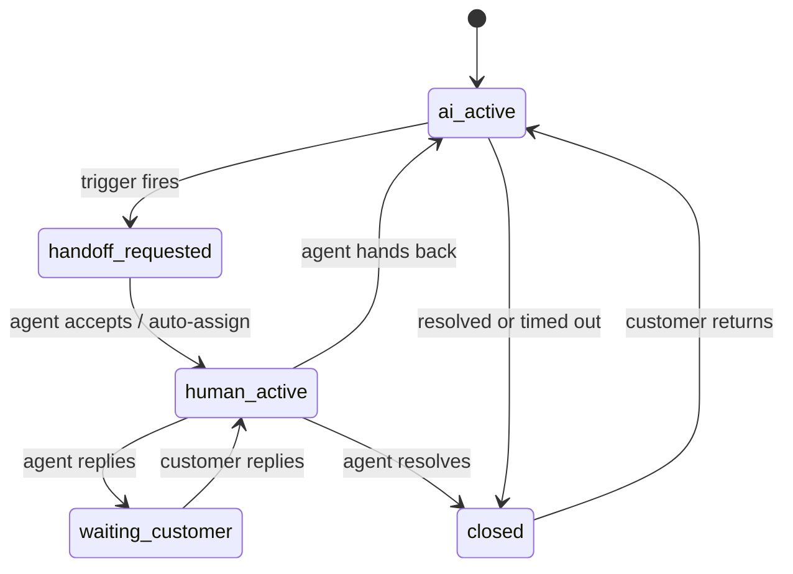

# Messaging, Webhooks and the Transactional Outbox

> Covers channel abstraction, webhook ingestion, the transactional outbox, idempotency, outbound delivery and human handoff.

---

## 1. Internal model

All channels normalise into one model. The domain never branches on "is this WhatsApp?" — only *capabilities* differ.

```
Contact ──< Conversation ──< Message ──< Attachment
                 │
                 ├─ assignment (human agent)
                 ├─ handoff_request
                 └─ conversation_summary
```

**Conversation modes:** `ai_active` · `handoff_requested` · `human_active` · `waiting_customer` · `paused` · `closed`
**Message direction:** `inbound` · `outbound` · `internal_note` · `system`
**Sender type:** `customer` · `ai` · `agent` · `system`
**Channel types:** `whatsapp` · `instagram_dm` · `messenger` · `instagram_comment` · `facebook_comment`

### Channel capabilities (declarative, per adapter)

| Capability | Why it matters |
|---|---|
| `supports_public_reply` | Comments can be answered publicly |
| `supports_private_reply` | Comment → DM transition |
| `messaging_window_hours` | WhatsApp/Meta 24-hour rules |
| `requires_template_outside_window` | WhatsApp template messages |
| `supported_media_types` | Validation before send |
| `max_text_length` | Chunking or truncation policy |
| `supports_read_receipts` / `typing` | UX affordances |

Capabilities are data, not `if` statements scattered through the domain.

---

## 2. Provider abstraction

`ChannelProvider` (one adapter per channel, ADR-0006):

- `verify_webhook(headers, raw_body) -> bool`
- `parse_events(payload) -> list[NormalizedEvent]`
- `send_message(integration, contact_ref, content) -> ProviderSendResult`
- `reply_to_comment(integration, comment_ref, content, visibility)`
- `fetch_profile(integration, provider_user_id)`
- `capabilities() -> ChannelCapabilities`

Rules: adapters do no business logic and no database writes beyond their own mapping tables; raw payloads are retained on `webhook_events`; adapters are covered by contract tests against recorded fixtures.

---

## 3. Webhook ingestion — thin, verified, transactional

The endpoint does exactly six things and returns:

1. **Verify** the provider signature over the raw body (constant-time), with replay-window checks where supported.
2. **Validate** the payload shape.
3. **Resolve** the integration → tenant from `(provider, provider_account_id)`.
4. **Open one PostgreSQL transaction** and insert `webhook_events` **and** `outbox_events`.
5. **Commit.**
6. **Return 200/202 immediately.**

```mermaid
sequenceDiagram
    participant P as Provider (Meta/Paddle)
    participant API as FastAPI webhook
    participant PG as PostgreSQL
    participant D as Outbox dispatcher (beat)
    participant R as Redis (broker)
    participant W as Celery consumer

    P->>API: POST /webhooks/{provider} (signed)
    API->>API: verify signature (raw body, constant time)
    API->>API: validate payload
    API->>PG: resolve integration -> tenant
    rect rgb(235,245,255)
    Note over API,PG: SINGLE TRANSACTION
    API->>PG: INSERT webhook_events (unique provider+provider_event_id)
    API->>PG: INSERT outbox_events (dedup_key, traceparent, correlation_id)
    API->>PG: COMMIT
    end
    API-->>P: 200 OK (fast)

    D->>PG: SELECT ... WHERE status='pending' FOR UPDATE SKIP LOCKED LIMIT n
    D->>PG: UPDATE -> 'dispatching', lease_expires_at, attempts+1
    D->>R: publish task (outbox_event_id, tenant_id, traceparent)
    D->>PG: UPDATE -> 'dispatched'
    R->>W: deliver task
    W->>PG: BEGIN; INSERT processed_events (unique) ; business writes ; COMMIT
    Note over W: conflict on processed_events -> skip (duplicate)
```

**No heavy work in the request path.** No AI, no provider callbacks, no media download, no embedding.

If signature verification fails: log, increment a metric, return the provider's expected rejection status, and **do not** create an outbox row. If the tenant cannot be resolved, still record the `webhook_events` row (Class D, `tenant_id` null) for debugging, and route it to an operator queue rather than to business processing.

---

## 4. Transactional outbox (ADR-0003)

### Why
`INSERT → COMMIT → celery.delay()` is **not atomic**. A crash, a Redis outage, or a network blip between commit and enqueue silently drops work: the database says the event arrived, but nothing processes it. Enqueuing first is worse — the task can run before (or without) the commit. The outbox makes the *intent to do work* part of the same transaction as the *state change*.

### Dispatcher algorithm

```
every POLL_INTERVAL (default 500 ms), per batch:
  BEGIN
    SELECT id, ... FROM outbox_events
      WHERE status = 'pending' AND available_at <= now()
      ORDER BY created_at
      FOR UPDATE SKIP LOCKED
      LIMIT batch_size
    UPDATE those rows
      SET status='dispatching', attempts=attempts+1,
          lease_expires_at = now() + lease_duration
  COMMIT

  for each claimed row:
    publish Celery task (carrying outbox_event_id, tenant_id, traceparent, correlation_id)
    on success: UPDATE status='dispatched', dispatched_at=now()
    on failure: UPDATE status='pending',
                available_at = now() + backoff(attempts) with jitter,
                last_error = ...
    if attempts >= max_attempts:
                UPDATE status='dead_letter'   -- alert

separately (reclaim sweep, every minute):
  UPDATE outbox_events SET status='pending'
   WHERE status='dispatching' AND lease_expires_at < now()
```

`SKIP LOCKED` allows multiple dispatcher instances safely. Payloads carry identifiers, never blobs.

### Idempotency — three independent layers

| Layer | Mechanism | Protects against |
|---|---|---|
| **Ingress dedup** | Unique `(provider, provider_event_id)` on `webhook_events` | Provider re-delivering the same event |
| **Publication dedup** | Unique `dedup_key` on `outbox_events` | The same producer creating duplicate work |
| **Consumer dedup** | Unique `(consumer, outbox_event_id)` in `processed_events`, inserted **inside the consumer's business transaction** | At-least-once delivery from the dispatcher |

The third layer is the important one: the consumer's effects and its "I processed this" marker commit together. If the marker insert conflicts, the consumer returns success without re-applying effects. Consumers must therefore never mix external side effects with database writes in the same step — external calls (sending a message) get their own attempt record and idempotency key (§5).

### Failure recovery matrix

| Failure point | Result | Recovery |
|---|---|---|
| Crash before COMMIT | Nothing persisted | Provider retries; ingress dedup prevents duplicates |
| Crash after COMMIT, before claim | Row `pending` | Dispatcher claims on the next poll |
| Crash after claim, before publish | Row `dispatching`, lease expires | Reclaim sweep resets to `pending` |
| Crash after publish, before `dispatched` | Task already queued; row `dispatching` | Lease expiry re-publishes → consumer dedup skips the duplicate |
| Consumer crashes mid-work | Business transaction rolls back with the marker | Celery retry, or lease-based re-publish |
| Redis down | Publication fails, rows stay `pending` | Backlog alert; automatic drain when Redis returns |
| Redis data loss | Queued tasks lost | Rows still `pending`/`dispatching` → re-dispatched. **This is why Redis needs no backup.** |
| Poison event | Repeated failures | Backoff to `max_attempts` → `dead_letter` → alert → documented replay runbook |
| Dispatcher stopped | Backlog grows | `outbox_oldest_pending_age_seconds` alert |

### Ordering
Global ordering is neither offered nor needed. Each event carries an `ordering_key` (normally the conversation id); consumers take a per-key advisory lock and insert messages by `provider_timestamp` + `sequence_no`, so late or out-of-order deliveries land in the right position rather than corrupting the thread.

### Monitoring
`outbox_pending_count`, `outbox_oldest_pending_age_seconds`, `outbox_dispatch_duration_seconds`, `outbox_dispatch_failures_total`, `outbox_dead_letter_total`, `outbox_reclaimed_total` — labelled by `event_type` and `status` only (never `tenant_id`).

---

## 5. Outbound delivery

Sending is the main **non-idempotent** external side effect, so it never rides directly on a business transaction.

1. The decision to send creates a `messages` row (`status = queued`) plus an outbox event — one transaction.
2. The outbound consumer creates a `delivery_attempts` row with a deterministic `idempotency_key` derived from `(tenant_id, message_id, attempt semantics)`.
3. It calls the provider adapter with a timeout, passing the provider's idempotency header where supported.
4. On success: store `provider_message_id`, mark the message `sent`, map it in `provider_message_map`.
5. On a retryable failure (5xx, timeout, 429): exponential backoff with jitter, honouring `Retry-After`.
6. On an **ambiguous** outcome (timeout after the request was sent): **do not blindly retry.** Mark `unknown`, and reconcile by querying the provider or matching an echo webhook before retrying.
7. On permanent failure: mark `failed`, surface it in the agent workspace, and alert if the failure rate breaches its threshold.

Per-tenant and per-integration outbound rate limiting uses Redis token buckets to stay inside provider limits; circuit-breaking pauses a failing integration rather than burning retries.

---

## 6. Data flow — incoming WhatsApp message

```mermaid
sequenceDiagram
    participant C as Customer
    participant WA as WhatsApp Cloud API
    participant API as Webhook endpoint
    participant PG as PostgreSQL
    participant D as Dispatcher
    participant W as events worker
    participant AIW as ai worker
    participant OUT as outbound worker

    C->>WA: sends a message
    WA->>API: signed webhook
    API->>PG: TX { webhook_events + outbox_events } COMMIT
    API-->>WA: 200
    D->>W: publish process_inbound_event
    W->>PG: processed_events guard
    W->>PG: upsert contact, conversation; insert message (ordered)
    W->>PG: entitlement + usage check
    alt conversation is ai_active and AI is enabled
        W->>PG: TX { ai_run created + outbox_event } COMMIT
        D->>AIW: publish generate_ai_response
        AIW->>AIW: build context, retrieve knowledge, call tools, call LLM
        AIW->>AIW: validate output (guardrails)
        alt safe to answer
            AIW->>PG: TX { message(queued) + outbox_event } COMMIT
            D->>OUT: publish deliver_message
            OUT->>WA: send (idempotency key, attempt record)
            OUT->>PG: mark sent + provider_message_id
        else escalate
            AIW->>PG: TX { handoff_request + conversation.mode=handoff_requested + outbox_event } COMMIT
        end
    else human_active
        W->>PG: notify assigned agent
    end
```

---

## 7. Data flow — Instagram / Facebook comment

Same backbone, different reply semantics and higher brand risk.

```
comment webhook (signed)
  → TX { webhook_events + outbox_events } → commit → 200
  → events worker:
       ignore our own comments and echoes
       upsert contact from the commenter
       find or create a conversation keyed by (post_ref, commenter)
       insert message with channel_type = *_comment
  → policy decision (tenant configuration):
       public reply | private reply (DM) | public ack + private reply | human review only
  → if AI is permitted: stricter guardrails than DMs
       - no prices, promises or policy statements unless tool/retrieval-backed
       - lower confidence threshold for escalation
       - optional mandatory human approval before publishing
  → outbound worker replies through the comment adapter
```

Specific handling: comment edits and deletions arrive as separate events and must update the stored message; a private reply may only be available once and within a provider-defined window; rate limits on public replies are stricter.

---

## 8. Human handoff

### Triggers
Explicit customer request · low AI confidence · guardrail refusal · restricted action (refund, cancellation, complaint) · repeated failure to resolve · negative sentiment · high-value sales signal · tenant rule (keyword, channel, business hours) · entitlement/usage exhaustion.

### Flow



On handoff the system atomically creates the `handoff_request`, flips `conversation.mode`, and emits an outbox event that generates the AI summary and notifies agents. **AI stops generating for that conversation immediately**; inbound messages are still ingested and stored.

### Agent workspace context
Customer profile and history · full message thread · AI-generated summary and handoff reason · knowledge snippets the AI used · relevant products/orders · suggested response (clearly labelled as a suggestion) · internal notes · channel constraints (messaging window, template requirement).

### Hand-back
Explicit agent action, or an optional inactivity policy. Hand-back writes a boundary marker so the AI's next context build starts from a summarised, agent-approved state rather than replaying the raw human exchange.

---

## 9. Provider failure handling

| Failure | Response |
|---|---|
| Signature mismatch | Reject, metric, no outbox row, alert on a spike |
| Provider 5xx / timeout on send | Retry with backoff + jitter, cap attempts |
| 429 rate limit | Honour `Retry-After`, throttle that integration via Redis token bucket |
| Token expired / permission revoked | Mark integration `degraded`, stop sending, notify the tenant admin, surface in the dashboard |
| Unknown payload shape | Store raw, mark `unrecognised`, alert; never guess |
| Sustained provider outage | Circuit-break the integration, keep events durable, drain when healthy |
